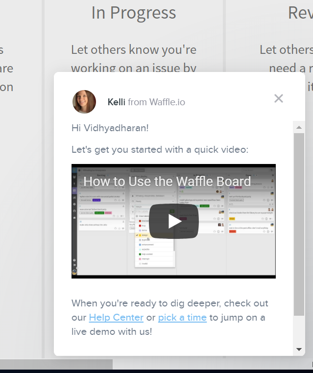

# Crack – the – idea

Some times when we discuss an idea, it scattered into many forms unless if we not brainstorm in a right way  
This page lists the goals and accomplishment.

# Todo
- [ ] prototype a 100DaysOfCode github app using design thinking
- [ ] Automatically suggest your next commit time 
- [ ] Notification to remind the user about the commit
- [ ] Leaderboard like :star: for 25 days, :star::star: 50 days , :star::star::star: 75 days and soon
- [ ] Suggestion about #100days0fcode when user checks his/her score
- [ ] Inpage updates to enable user to input about their readings, tutorials, with tags and pictures
- [ ] An animation at the footer to point his milestone :triangular_flag_on_post: with motivational messages 
- [ ] Sparkling Flower / snow / fire to decorate the page to show the mood :full_moon_with_face:
- [ ] Auto suggestion on first login i.e how to use this app. For example below waffle.io shows
       
- [ ] And 100days0fcode badge similar to waffle 
	   

# 100DaysOfCode

### Suggestion
 - Use https://www.draw.io/ for mockup desgin
 - https://stackedit.io/ for uml desgin
 - For timer http://hilios.github.io/jQuery.countdown/
 - Github activity stream https://github.com/caseyscarborough/github-activity , [live demo](http://caseyscarborough.com/github-activity/) 
 - Use [waffle.io](https://waffle.io/) for project management
 

### Features of - 100DaysOfCode github app
 - Get input from user as his github username
 - Clock for next challenge time with ticking
 - Intelligently analyze the user commit history 
 - Draw a analyze report using chartjs

### Data collection and training set preparation
 - Take some GitHub users -vidhya03,aaradhanas and few more
 - Analyze the commit history and pattern
 - Data set should contain the following info:
    - User
    - Date
    - Time
    - Number of contributions
    - Technologies
    - Repos
 - The data should be collected on a daily basis. If there is no commit on a particular day, the same   should be specified.

 ### Decide on the Machine Learning algorithms
 - [ ] K Nearest neighbours
 - [ ] Decision tree
 - [ ] Naive Bayes classifier
 - [ ] Logistic Regression
 - [ ] Support Vector Machines

### ML libraries in Python
 - scipy
 - numpy
 - matplotlib
 - pandas
 - sklearn

### Questions to be answered via ML
 - How likely is a user to commit today?
 - What is the time range during which he commits on a week day?
 - What is the time range during which he commits on a week end / holiday?
 - What are the technologies he is interested in?
 - What projects/technologies he might pick up in the future?
 - Is he possibly a #100DaysOfCode developer?

## ML references
- [ML Mastery](https://machinelearningmastery.com/machine-learning-in-python-step-by-step/)
- [AI Course](https://courses.edx.org/courses/course-v1:ColumbiaX+CSMM.101x+1T2017/course/)

Credits
=======

- [@vidhya03](https://github.com/vidhya03) : The Tech Enthusiast
- [@aaradhanas](https://github.com/aaradhanas): The Zealous Explorer

